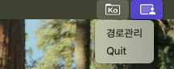

# Kofix

<div style="text-align: center; padding: 20px;">
  
</div>


Mac OS 한국어 자소분리를 해결하기 Kofix App 입니다.


- 윈도우 간 작업 및 품의서를 작성할 때, 타 인터페이스에서 한글이 깨지는 것이 매우 귀찮아 작성하게 되었습니다.
- 외부 스토리지 등 마운트 된 경로에도 사용가능합니다.
- 파일 이동(상태변경)시에만 동작합니다.

- pyqt5를 사용하여 생각보다 용량이 큽니다... 차후 바꾸어 두겠습니다.

<br>

<br>

<br>

# Kofix macOS 메뉴바 앱

**Kofix**는 macOS용 파일명 정규화 및 감시 기능을 제공하는 메뉴바 앱입니다. 이 앱은 사용자에게 편리하게 파일명 정규화 작업을 할 수 있는 인터페이스를 제공합니다. 아래 문서는 앱을 설치하고 사용하는 방법에 대한 설명입니다.


## 1. 개요

- **Kofix**는 `rumps` 라이브러리를 사용하여 macOS 메뉴바에서 실행되는 앱으로, 지정된 폴더 내의 파일명들을 정규화하고, 
- 사용자에게 실시간으로 파일 변경 사항을 모니터링할 수 있는 기능을 제공합니다.


<br>

<br>

<br>


## 2. 설치 방법

### 2.1. 패키징된 앱 설치

1. **다운로드**: 아래 링크에서 **Kofix** 앱을 다운로드할 수 있습니다.
   
   - [Kofix macOS 앱 다운로드 링크](https://github.com/mungOps/Kofix/releases/download/untagged-f131434d1bbf9f1b7645/Kofix.zip)

2. **앱 실행**:
   - 다운로드한 `.app` 파일을 더블 클릭하여 실행합니다.
   - 메뉴바에 Kofix 아이콘이 표시됩니다.

3. **필요한 리소스**:
   - 앱 실행에 필요한 `icon.icns` 및 `icon.png` 아이콘 파일은 `resources` 폴더에 포함되어 있습니다. 이 파일들은 앱의 메뉴바 아이콘으로 사용됩니다.


### 2.2. 소스 코드

1. GitHub에서 소스 코드를 다운로드하거나 클론합니다:

   ```bash
   git clone https://github.com/mungOps/Kofix.git
   ```

2. 프로젝트 디렉토리로 이동 후, 가상 환경을 생성하고 필요한 의존성을 설치합니다.

   ```bash
   cd Kofix
   python3 -m venv kofix-env
   source kofix-env/bin/activate
   pip install -r requirements.txt
   ```

3. `py2app`을 사용하여 앱을 빌드하거나 실행합니다.:

   ```bash
   # 실행
   python main.py

   # 빌드
   python setup.py py2app
   ```

   빌드가 완료되면 `dist` 폴더에 `Kofix.app`이 생성됩니다.


<br>

<br>

<br>

## 3. 사용법

### 3.1. 메뉴바 아이콘 클릭

- Kofix 앱은 메뉴바에서 실행됩니다. 앱 아이콘을 클릭하면 설정 메뉴 및 파일 감시 기능을 사용할 수 있습니다.
<div style="text-align: center; padding: 20px;">
  
</div>


<br>

- 경로관리에서 경로를 추가 가능합니다.
<div style="text-align: center; padding: 20px;">
  
</div>
<div style="text-align: center; padding: 20px;">
  
</div>
<div style="text-align: center; padding: 20px;">
  
</div>

<br>


<br>

## 4. 라이센스

[MIT License](LICENSE)
